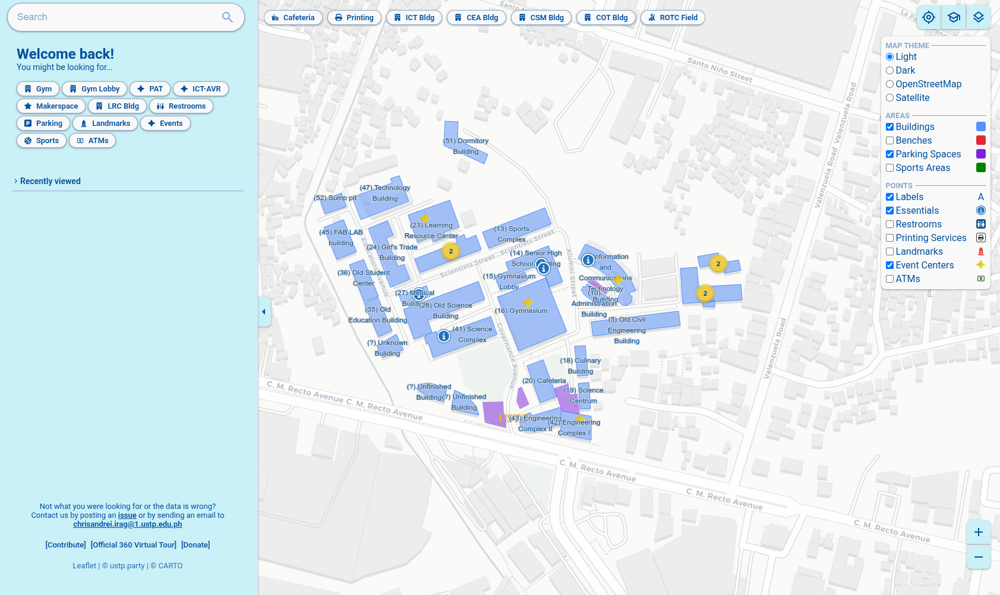

<a href="https://github.com/ustp-party/map">USTP-CDO Campus Interactive Map</a> is an interactive map of my alumni university University of Science and Technology of Southern Philippines inspired by <a href="https://campus-map.stanford.edu/">Stanford</a>. It features accessible, searchable, and shareable links to landmarks, event centers, buildings, utilities and more. These locations are accompanied with on site pictures as visual aid. All types of locations have their own identifiable pins on the map.

=== "Landing Page"

    

=== "Points of Interests (POIs)"

    <video autoplay muted loop playsinlinesrc controls>
        <source src="../../../images/web-dev/map/POIs.mp4" type="video/mp4">
    </video>

=== "Finding POIs"

    <video autoplay muted loop playsinlinesrc controls>
        <source src="../../../images/web-dev/map/Finding POIs.mp4" type="video/mp4">
    </video>

=== "Switching Themes"

    <video autoplay muted loop playsinlinesrc controls>
        <source src="../../../images/web-dev/map/Switching Themes.mp4" type="video/mp4">
    </video>

## Features

- Desktop/Mobile friendly
- Searchable Points of Interests
- UI Theme switching
- GPS Enabled
- Enabling/disabling POIs
- Location sharing
- Descriptive locations

## Methodology

- Open-source data augmented with gathered data
- Frameworks
  - [Svelte](https://svelte.dev/) for the frontend framework
  - [Leaflet](https://leafletjs.com/) for the mapping engine
- Cloud
  - Static page hosted on [Cloudflare Pages](https://pages.cloudflare.com/)
  - Images hosted on [Cloudinary](https://cloudinary.com/)

## Metrics

### Lighthouse

| Metric         | Description |
| -------------- | ----------- |
| Performance    | 82          |
| Accessibility  | --          |
| Best Practices | 96          |
| SEO            | 100         |
